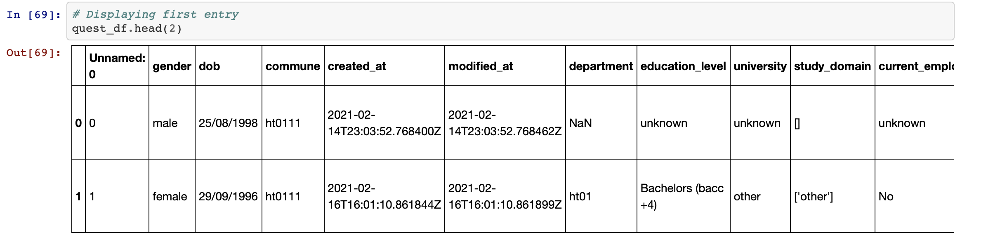

 
 

<h1> Ayiti Analytics Probability and Statistics Project </h1>

Use all the files to have a final datasets to have the following columns
 <ul>
    <li>questid</li>
    <li>gender</li>
    <li>age (age of applicant)</li>
    <li>communeName (use data prep in commune file)</li>
    <li>application_date (created at in quest file)</li>
    <li>enroll_date (created_at in enroll file)</li>
    <li>is_enroll (Yes/No) (use data prep in enroll file)</li>
    <li>Education Level</li>
    <li>Communication channels(hear_AA1)</li>
    <li>Bootcamp Insterest (after_AA)</li>
    <li>Payement Date (use ord and transaction files)</li>
    <li>Payed (Yes/No)</li>
    <li>list Technologies as columns based (use get_dummies)</li>
    <li>list  Study domains (use get_dummies)</li>
    <li>Job is formal</li>
    <li>Have computer at home</li>
    <li>Have internet at home</li>
 </ul>
 
 

<h2 align=center> Dataset Overview </h2>

#### 1. Commune

#### 2. Students Enrollment

#### 3. Industry

#### 4. Orders

#### 5. Questions

#### 6. Study Domain

#### 7. Technical Background

#### 8. Transaction

